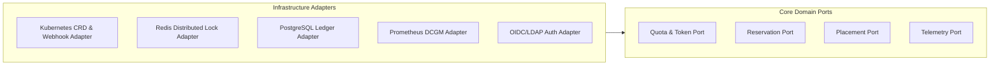

# Architecture Spine — University AI Compute Management Platform

## Design Paradigm

The system adopts a **Hexagonal Event-Driven Control Plane with the Kubernetes Operator Pattern**.
All core governance concerns (reservations, quotas, placement, and telemetry) are modeled as domain entities decoupled from underlying transport layers through explicit ports and adapters.
Inside Kubernetes, state synchronization is driven by custom controllers reconciling Custom Resource Definitions (CRDs) against physical cluster reality, enforcing desired state declaratively.



## System Boundaries & Dependencies

The platform is partitioned into five distinct architectural boundaries:

1. **Edge & Security Layer:** Ingress Gateway (Envoy) terminating TLS and enforcing JWT validation against institutional OIDC/SAML providers before proxying to internal services.
2. **Platform Control Plane:** Stateless Go-based REST/gRPC backend managing administrative business logic, token metering algorithms, and reservation scheduling.
3. **Distributed State & Concurrency Layer:** High-availability Redis cluster for atomic token bucket operations and distributed mutexes; PostgreSQL for ACID relational auditing, user profiles, and historical accounting.
4. **Kubernetes Cluster & Workload Orchestrator:** Kubernetes API Server, Mutating/Validating Admission Webhooks, Custom Scheduler Plugins, Kubeflow Training Operator (PyTorchJob/TFJob), and Kubeflow Notebook Controller.
5. **Physical Heterogeneous Fleet:** Standard Tier nodes (single 24 GB VRAM GPUs) and High-Capacity Tier nodes (dual 48 GB VRAM GPUs / 96 GB aggregate) instrumented with NVIDIA GPU Operator and DCGM node exporters.

## State Mutation & Invariant Rules

To prevent concurrency hazards and resource starvation, state transitions must adhere strictly to these invariants:

1. **Atomic Token Decrement:** Token deduction and reservation verification MUST execute within an atomic Redis Lua script before admission webhook approval. Overdrafts and double-allocation are strictly impossible.
2. **Deterministic Placement Isolation:** Standard workloads ($\le 24$ GB VRAM) MUST NEVER bind to High-Capacity (2x48 GB) nodes unless an explicit administrative exception token is attached to the pod manifest.
3. **Graceful Classroom Lockout:** Classroom reservation locks are immutable once $T-15m$ is reached. At $T-15m$, all preemptible workloads on designated nodes MUST receive SIGTERM; any pods remaining at $T-0m$ are forcefully deleted with zero grace period.
4. **Autonomous Quarantining:** Any node emitting an unrecoverable GPU XID error or sustaining $> 88°C$ for $> 60$ seconds MUST be cordoned immediately via the Telemetry Controller. Workloads on the affected node are requeued to healthy nodes within 30 seconds.

## Invariants & Rules

### AD-1 — Kubernetes-Native CRD Control Plane

- **Binds:** CAP-1, CAP-2, CAP-3, CAP-4, CAP-6
- **Prevents:** Independent microservices inventing bespoke shadow state stores that diverge from physical cluster reality.
- **Rule:** All reservations, quotas, and workloads MUST be modeled as Kubernetes Custom Resources (`GpuReservation`, `ComputeQuota`, `InteractiveSession`, `TrainingJob`), reconciled via a central Go operator. Direct unmediated pod manipulation is forbidden.
- **Context:** Managing state outside Kubernetes causes reconciliation lag and split-brain states when physical nodes reboot or pods fail.
- **Status:** Approved
- **Consequences:** Declarative reconciliation, native etcd persistence, and built-in k8s RBAC integration.
- **Rejected Alternatives:** Standalone relational DB job manager polling Kubernetes asynchronously.

### AD-2 — Dynamic Admission Webhook with Two-Phase Quota Locking

- **Binds:** CAP-1, CAP-2, CAP-3
- **Prevents:** Race conditions and double-spending of GPU-hours / token buckets under concurrent submission spikes.
- **Rule:** Admission controllers MUST execute an atomic Redis/PostgreSQL distributed token lock before validating and mutating the Pod/Job spec. If token balance is insufficient or the node tier is reserved by a class lock, admission MUST immediately reject with HTTP 429 / admission denial.
- **Context:** High concurrency at start of lab sessions could otherwise oversubscribe physical GPUs before metrics collectors register pod launches.
- **Status:** Approved
- **Consequences:** Sub-millisecond admission validation and zero over-subscription of physical GPUs.
- **Rejected Alternatives:** Asynchronous post-admission quota auditing (allows overdrafts).

### AD-3 — VRAM-Tiered Scheduling via Node Affinity and Custom Scheduler Profiles

- **Binds:** CAP-3, CAP-4
- **Prevents:** Low-VRAM interactive student workloads occupying 2x48 GB high-capacity nodes, causing researcher starvation.
- **Rule:** Workload pods MUST carry mutated node affinities based on their declared VRAM profile (`gpu-tier: standard-24gb` vs `gpu-tier: highcap-48gb`). Jobs requesting $\le 24$ GB VRAM are hard-restricted from scheduling onto high-capacity nodes unless specifically whitelisted by an administrative override.
- **Context:** High-capacity nodes are scarce capital investments required for multi-GPU distributed model training.
- **Status:** Approved
- **Consequences:** Deterministic resource isolation; high-capacity nodes remain reserved for distributed batch pipelines.
- **Rejected Alternatives:** Unified unconstrained scheduling pool relying on default Kubernetes least-allocated weighting.

### AD-4 — Graceful Preemption Engine with 15-Minute Drain Horizon

- **Binds:** CAP-2, CAP-4
- **Prevents:** Sudden SIGKILL termination of multi-hour research jobs or classroom disruption during lab session start times.
- **Rule:** Classroom reservations MUST trigger an automated pre-eviction event exactly 15 minutes prior to scheduled start time ($T-15m$). Preemptible jobs on reserved nodes MUST receive SIGTERM / Kubeflow checkpoint signal, allowing graceful state flushing before final pod eviction at $T-0m$.
- **Context:** Balancing instructional guarantees with research workload preservation.
- **Status:** Approved
- **Consequences:** 100% reservation readiness for students with zero data loss for checkpoint-compliant research runs.
- **Rejected Alternatives:** Immediate hard eviction at class start time; non-preemptible best-effort queues.

### AD-5 — Autonomous Node Health Quarantine and Workload Eviction

- **Binds:** CAP-5
- **Prevents:** Jobs landing on failing or thermally degraded GPU nodes leading to silent compute corruption or hardware damage.
- **Rule:** Telemetry agents ingesting DCGM metrics MUST trigger an automatic node cordon if an unrecoverable XID error is detected or if GPU temperature exceeds 88°C for $> 60$ seconds. Evacuated pods MUST be requeued with priority increment.
- **Context:** Unattended long-running training jobs must not fail silently due to localized hardware degradation.
- **Status:** Approved
- **Consequences:** Fast MTTR, automated protection of physical assets, and minimal job loss.
- **Rejected Alternatives:** Manual sysadmin alerting and manual node maintenance.

### AD-6 — Institutional SSO & Namespace-Enforced Multi-Tenancy

- **Binds:** CAP-6
- **Prevents:** Cross-tenant data leaks, unauthorized access to high-capacity GPU tiers, and privilege escalation.
- **Rule:** All external ingress traffic MUST terminate at an API Gateway integrating with university OIDC/SAML providers. Users are mapped to dedicated Kubernetes namespaces with strict NetworkPolicies, resource quotas, and RBAC roles.
- **Context:** Multi-tenant university environments require strict sandboxing between student course projects and confidential grant research data.
- **Status:** Approved
- **Consequences:** Zero trust boundary between student labs and confidential grant research data.
- **Rejected Alternatives:** Shared single-namespace cluster with application-level security filters.

## Consistency Conventions

| Concern | Convention |
| :--- | :--- |
| **Naming Conventions** | CamelCase for CRDs (`GpuReservation`); kebab-case for resource instances (`cs402-lab-tier1`); uppercase for metric names (`GPU_VRAM_UTILIZATION_RATIO`). |
| **API & Payload Formats** | OpenAPI 3.1 REST + gRPC Protobuf v3; timestamps in ISO-8601 UTC (`YYYY-MM-DDTHH:mm:ssZ`); UUIDv4 for all entity IDs. |
| **Error Handling & Envelopes** | RFC 7807 Problem Details for HTTP APIs; structured error codes (`ERR_QUOTA_EXCEEDED`, `ERR_TIER_RESERVED`, `ERR_VRAM_OVERFLOW`). |
| **Authentication & AuthZ** | OpenID Connect (OIDC) JWT Bearer tokens; RBAC roles enforced via Kubernetes SubjectAccessReview and Envoy RBAC filter. |
| **Logging & Telemetry** | Structured JSON logging to stdout with trace-context (`trace_id`, `user_id`, `namespace`); Prometheus metrics exposed at `/metrics`. |

## Stack

| Name | Version |
| :--- | :--- |
| Kubernetes | v1.30.2 |
| Kubeflow Training Operator | v1.8.0 |
| Kubeflow Notebook Controller | v1.8.0 |
| NVIDIA GPU Operator | v24.6.0 |
| Containerd | v1.7.18 |
| Go (Platform Operator & API) | v1.22.5 |
| Python (SDK & Scripts) | v3.12.4 |
| Redis (Token Locks & Queue) | v7.2.5 |
| PostgreSQL (State Ledger & Auth) | v16.3 |
| Envoy Gateway (Ingress & TLS) | v1.1.0 |
| Prometheus (Metrics Storage) | v2.53.1 |
| NVIDIA DCGM-Exporter | v3.3.5 |
| Grafana (Monitoring UI) | v11.1.0 |
| React (Frontend Portal) | v18.3.1 |
| TailwindCSS | v3.4.4 |
| TypeScript | v5.5.3 |

## Structural Seed

```text
university-ai-compute-platform/
  api/                      # OpenAPI specifications and gRPC protobuf definitions
  cmd/
    apiserver/              # Central control plane API and authentication gateway
    operator/               # Kubernetes controller reconciling custom resources (CRDs)
    telemetry-agent/        # DCGM telemetry scraper and automated node health agent
  deploy/
    helm/                   # Helm charts for platform deployment
    crds/                   # Custom Resource Definitions (GpuReservation, ComputeQuota)
    manifests/              # Kubernetes base manifests and admission webhooks
  internal/
    domain/                 # Core domain entities: Quota, Reservation, Placement
    services/               # Business logic services implementing domain ports
    adapters/
      k8s/                  # Client-go Kubernetes client and informer implementations
      redis/                # Atomic token bucket scripts and distributed locks
      postgres/             # Database access, migrations, and audit trails
      telemetry/            # Prometheus and DCGM telemetry client
  web/                      # React/TypeScript management portal and student launchpad
```

## Capability → Architecture Map

| Capability / Area | Lives in | Governed by |
| :--- | :--- | :--- |
| **CAP-1** (Multi-Tier Quota & Token Metering) | `internal/domain/quota`, `cmd/apiserver` | AD-1, AD-2 |
| **CAP-2** (Classroom Reservation & GPU Lockout) | `internal/domain/reservation`, `cmd/operator` | AD-1, AD-4 |
| **CAP-3** (Heterogeneous Hardware Placement) | `internal/adapters/k8s`, `deploy/manifests` | AD-1, AD-3 |
| **CAP-4** (Distributed Training Workload Lifecycle) | `deploy/crds`, `cmd/operator` | AD-1, AD-4 |
| **CAP-5** (Cluster Telemetry & Node Eviction) | `cmd/telemetry-agent`, `internal/adapters/telemetry` | AD-5 |
| **CAP-6** (Role-Based Access Governance) | `cmd/apiserver`, `internal/domain/auth` | AD-1, AD-6 |

## Deferred

1. **Dynamic Multi-Instance GPU (MIG) Slicing:** Deferred until hardware procurement of NVIDIA H100/B200 architecture; current 24 GB / 48 GB GPUs are governed as whole physical integer units.
2. **Cross-University Multi-Cluster Federation:** Deferred to Phase 8 / subsequent expansion; current platform scope is strictly bounded to the local on-premise Kubernetes cluster.
3. **Hardware-Level Dynamic Power Throttling (P-State Control):** Deferred; current power governance relies on node cordoning and pod-level concurrency caps under 15 kW facility envelope.
