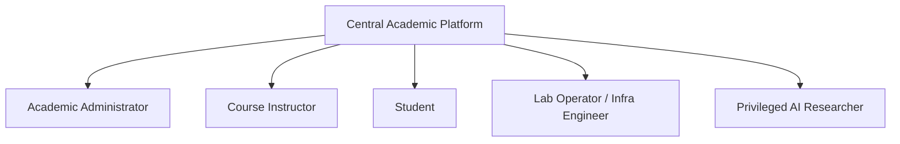

# Project Brief: University AI Compute Management Platform

> Centralized Governance, Dynamic Scheduling, and Heterogeneous GPU Fleet Orchestration for Academic AI Workloads

**Created:** 2026-08-31  
**Project:** University AI Compute Management Platform  
**Author:** Seprockill & Saga (WDS Strategic Analyst)  
**Brief Type:** Complete Strategic Foundation  
**Phase:** Phase 1 — Product Brief  

---

## 1. Executive Summary & Vision

### Vision Statement
To establish an enterprise-grade, centralized AI compute governance platform that transforms a heterogeneous on-premise GPU fleet into a reliable, fair-share utility for the university community. The platform eliminates ad-hoc spreadsheets and unmonitored SSH access, replacing them with intelligent Kubernetes-driven scheduling, automated quota enforcement, time-guaranteed instructional reservations, and native support for distributed research workloads via Kubeflow.

### Purpose & Problem Statement
* **Legacy Friction:** Previously, GPU resources were accessed through fragmented, manual mechanisms (shared SSH keys, manual reservations in spreadsheets, rogue long-running jobs, and unmonitored VRAM hogs).
* **The Conflict:** Scheduled academic classes suffered sudden interruptions due to unmanaged resource contention, while high-capacity research training jobs experienced starvation or unpredictable manual termination.
* **The Solution:** A unified control plane providing role-based self-service access, proactive capacity reservation for courses, strict anti-monopolization fair-share queues, and automated workload routing matching job specs to GPU VRAM tiers.

---

## 2. Positioning Statement

For **university academic leaders, faculty instructors, AI researchers, and students** who require **reliable, transparent, and frictionless access to specialized GPU compute resources**, the **University AI Compute Management Platform** is a **centralized compute orchestration and governance portal** that **democratizes GPU access across teaching labs, interactive notebooks, and large-scale model training**. Unlike **unmanaged bare-metal SSH clusters, generic cloud VMs with unpredictable costs, or manual spreadsheet reservation systems**, our platform **guarantees zero class disruptions through hard instructional reservations, enforces automated fair-share quotas, and natively routes distributed workloads across heterogeneous GPU tiers (24 GB standard and 2x48 GB high-capacity nodes) via Kubernetes and Kubeflow.**

### Positioning Breakdown
* **Target Customer:** Academic institutions, computer science/AI faculties, research labs, and central IT/infrastructure teams.
* **Need / Opportunity:** Maximum utilization of on-premise capital investments (heterogeneous GPUs) without administrative chaos or instructional outages.
* **Category:** Academic AI Compute Governance & Workload Orchestration Platform.
* **Key Benefit:** Deterministic compute availability: zero class disruptions for teaching, friction-free sandbox environments for students, and high-throughput distributed execution for researchers.
* **Differentiator:** Deep integration between scheduled academic calendars (hard preemption/reservations) and elastic batch ML pipelines (Kubeflow + Kubernetes dynamic GPU partitioning and queue prioritization).

---

## 3. Heterogeneous Fleet & Hardware Topology

The platform directly governs and orchestrates the following local hardware fleet:

| Node Tier | Hardware Specs | Total VRAM | Primary Workload Assignment | Scheduling & Preemption Policy |
| :--- | :--- | :--- | :--- | :--- |
| **Standard Tier** | Single 24 GB VRAM GPUs | 24 GB / node | Undergraduate / Graduate teaching, interactive Jupyter sessions, inference experiments, lightweight fine-tuning (LoRA). | High preemption resilience; auto-sleep on idle (>30 min); quick container re-spawning. |
| **High-Capacity Tier** | Dual 48 GB VRAM GPUs (2x48 GB) | 96 GB aggregate / node | Advanced AI research, multi-GPU distributed model training (PyTorchJob / TFJob via Kubeflow), deep LLM pre-training / full fine-tuning. | Priority queue with elastic backfill; gang-scheduling; checkpoint-aware preemptible execution. |

### Architectural Stack
* **Orchestration Engine:** Kubernetes (k8s) with NVIDIA GPU Operator & Device Plugin.
* **ML Workload Manager:** Kubeflow (Training Operator, Notebook Controller, Katib for hyperparameter tuning, Pipelines).
* **Governance Plane:** Custom Web Management Portal & API Gateway with LDAP/SSO integration, quota controller, and metrics aggregator.
* **Telemetry & Monitoring:** Prometheus + Grafana + DCGM (Data Center GPU Manager) for real-time VRAM, compute utilization, power, and thermal tracking.

---

## 4. Stakeholder Personas & User Profiles

The platform is designed around 5 distinct stakeholder personas across academic and administrative tiers:

### 1. Academic Administrator (Strategic Oversight & Stewardship)
* **Profile:** Department Chairs, Deans, and Faculty IT Directors.
* **Key Goals:** Maximize return on GPU capital investment; ensure equitable departmental distribution; monitor grant-funded resource utilization; audit compliance and access logs.
* **Pain Points:** Lack of visibility into GPU idle times; faculty complaints regarding unfair resource hoarding; unexpected compute bottlenecks during grant deadlines.
* **Platform Value:** Comprehensive analytics dashboards displaying fleet utilization rates, departmental chargeback/accounting reports, and audit trails.

### 2. Course Instructor (Curriculum Delivery & Classroom Reliability)
* **Profile:** Professors, Lecturers, and Teaching Assistants conducting AI/ML coursework.
* **Key Goals:** Guarantee 100% compute availability during scheduled lab sessions and exam windows; deploy standardized notebook environments to classes with one click; monitor student activity.
* **Pain Points:** Class sessions stalled because unauthorized research jobs consumed all GPU memory; complex manual environment setup for novice students.
* **Platform Value:** **Zero Class Disruption Guarantee** via calendar-integrated GPU reservations that lock capacity 15 minutes before class and auto-preempt lower-priority jobs gracefully.

### 3. Student (Frictionless Learning & Experimentation)
* **Profile:** Undergraduate and Master's students enrolled in AI, Deep Learning, and Data Science courses.
* **Key Goals:** Launch JupyterLab or VS Code environments immediately without configuring CUDA drivers; run assignments within safe quota boundaries; receive clear feedback on queue wait times.
* **Pain Points:** Intimidating Linux SSH setups; out-of-memory (OOM) crashes caused by neighbor processes on unshared machines; losing unsaved work.
* **Platform Value:** Instant browser-based IDE access, pre-loaded course kernels, automatic ephemeral checkpointing, and clear usage quota visibility.

### 4. Lab Operator / Infrastructure Engineer (System Health & Operations)
* **Profile:** High-Performance Computing (HPC) Sysadmins, DevOps/Platform Engineers.
* **Key Goals:** Maintain 99.9% node uptime; balance thermal and power envelopes; automate Kubernetes node drains and driver patching; enforce security isolation (multi-tenancy).
* **Pain Points:** Manually resolving zombie processes, rebooting locked GPUs, fielding constant support tickets for access permissions.
* **Platform Value:** Automated health checks, automated GPU reset/cleanup routines, granular RBAC policies, and live alerts for thermal or VRAM threshold breaches.

### 5. Privileged AI Researcher (Deep Experimentation & High-Scale Training)
* **Profile:** PhD candidates, Postdoctoral Fellows, and Principal Investigators (PIs) running cutting-edge models.
* **Key Goals:** Direct allocation of 2x48 GB nodes; launch distributed multi-GPU / multi-node Kubeflow pipelines; long-running batch execution with guaranteed non-preemption windows.
* **Pain Points:** Inability to run large batch jobs due to fragmented single-GPU allocations; lack of Kubeflow pipeline automation.
* **Platform Value:** High-capacity node tier reservations, Kubeflow Training Operator integration, automated checkpoint hooks, and off-peak elastic batch scheduling.

---

## 5. Measurable Success Criteria & Key Performance Indicators (KPIs)

| Pillar | Metric / KPI | Baseline (Legacy) | Target (Platform Goal) | Measurement Method |
| :--- | :--- | :--- | :--- | :--- |
| **Fleet Utilization** | **Aggregate GPU Utilization Rate** | ~35% (isolated silos) | **≥ 80% sustained** | Continuous DCGM Prometheus metrics across 24h/7d rolling windows. |
| **Instructional Reliability** | **Class Session Disruption Rate** | 12–18% session failures | **0.0% (Zero Disruptions)** | Automated reservation locks + pre-class health checks. |
| **Fairness & Governance** | **Fair Quota Distribution** | Ad-hoc / unmonitored | **100% Policy Compliance** | Kubernetes resource quotas + priority class preemption audits. |
| **Operational Agility** | **Time-to-Interactive Session** | 2–4 hours (manual setup) | **< 45 seconds** | Web portal click-to-Jupyter readiness. |
| **Administrative Overhead** | **Manual Ticket Processing Time** | 2–5 business days | **Instant self-service (< 1 min)** | Automated RBAC verification via institutional SSO. |
| **Job Throughput** | **Batch Queue Execution Latency** | Unpredictable wait times | **SLA-tiered scheduling** | Kubeflow queue wait telemetry. |

---

## 6. Business & Operating Model (Academic Tiering)

* **Internal Service Model:** Institutional Shared Service Center.
* **Tiering Architecture:**
  1. **Course / Education Tier:** High concurrency, standard 24 GB GPU nodes, time-windowed reservation, ephemeral storage.
  2. **Student Sandbox Tier:** Standard 24 GB GPUs, dynamic preemption, 2-hour idle timeout, individual daily compute budgets.
  3. **Standard Research Tier:** 24 GB / 48 GB nodes, batch queueing, medium priority, elastic night/weekend execution.
  4. **High-Priority Research Tier (Grant/PI):** Dedicated reservation on 2x48 GB nodes, distributed Kubeflow pipeline access, persistent NVMe storage.

---

## 7. Platform & Device Strategy

* **Primary Interface:** Web-Based Responsive Administrative & Developer Portal (Desktop-first: 1920×1080 / 1440×900; Tablet-compatible for lab monitoring).
* **Developer Access Modalities:**
  1. *Browser IDE:* Embedded JupyterLab, VS Code Web, and MLflow/Kubeflow Dashboards.
  2. *CLI & API Access:* Authenticated `unictl` CLI and REST/gRPC endpoints for pipeline automation and CI/CD triggers.
* **Security & Multi-Tenancy:**
  - Strict Namespace Isolation in Kubernetes.
  - Institutional LDAP / OAuth2 / SAML single sign-on with role mapping.
  - Hardware-level memory isolation preventing cross-tenant data leakage.

---

## 8. Tone of Voice & UI Microcopy Guidelines

| Attribute | Description | Good Example (✅) | Bad Example (❌) |
| :--- | :--- | :--- | :--- |
| **Clear & Authoritative** | Precise technical terminology without ambiguity. | ✅ "24 GB GPU reserved for CS-402 Lab (14:00–16:00). 18 active pods attached." | ❌ "GPU is busy right now." |
| **Actionable & Reassuring** | Immediate next steps when quotas or preemption occur. | ✅ "Quota exceeded (Max 4 GPUs). Your job is queued in position #2 (est. wait: 12 min)." | ❌ "Error 403: Forbidden." |
| **Academic & Empathetic** | Respects both student learning curves and researcher rigor. | ✅ "Environment ready. CUDA 12.4 and PyTorch 2.4 loaded." | ❌ "Container launched." |

---

## 9. Constraints & Risk Management

1. **Heterogeneity Constraint:** Seamless abstraction of 24 GB vs 48 GB capabilities so users do not accidentally launch 70B parameter models on 24 GB nodes causing out-of-memory fatal loops.
2. **Thermal & Electrical Limits:** Server room power caps require workload throttling if aggregate node draw exceeds facility limits.
3. **Network & Storage Bandwidth:** High-throughput dataset staging (NVMe cache) required to avoid GPU starvation during multi-node Kubeflow runs.
4. **Zero-Downtime Migration:** Existing researchers running manual workflows must be migrated with zero loss of persistent datasets.

---

## 10. Next Steps & Traceability

* [x] **Phase 0: Project Setup** — Completed on 2026-08-31
* [x] **Phase 1: Product Brief** — Generated in `design-artifacts/A-Product-Brief/project-brief.md`
* [ ] **Phase 2: Trigger Mapping** — Map psychological drivers, fears, and motivations for each persona (`B-Trigger-Map/`)
* [ ] **Phase 3: UX Scenarios** — Outline journey flows for Reservation, Job Launch, and Monitoring (`C-UX-Scenarios/`)
* [ ] **Phase 4: UX Design** — Detailed screen specifications and wireframes
* [ ] **Phase 5: Agentic Development** — Automated Kubernetes controller & frontend build (Mimir)

---
*Created under Whiteport Design Studio (WDS) Methodology — Approved by Saga (📚 WDS Strategic Analyst)*
